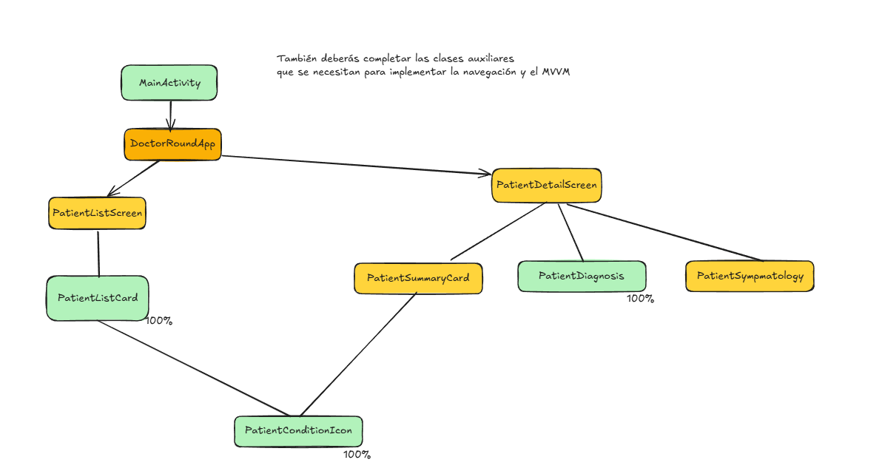
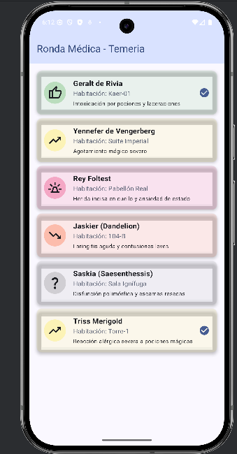
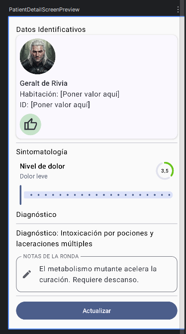

# 🏥 Examen Parcial PMDM: Doctor Round (Edición Temeria)

**Duración:** 120 minutos
**Modalidad:** Semipresencial
**Recursos Permitidos:** Repositorio personal, documentación offline incluida en el proyecto (`MVVM_HELP.md` y `NAVIGATION_HELP.md`). **SIN INTERNET.**

## 1. Contexto del Proyecto

Estás desarrollando **"Doctor Round"**, una aplicación para el seguimiento médico de pacientes en el Hospital de Wyzima (Capital de Temeria en el Universo de **The Witcher**).

Se te proporciona un proyecto base con la siguiente estructura:

```text
net.iessochoa.sergiocontreras.doctorround
│
├───data
│       PatientRepository.kt (Datos simulados - NO TOCAR)
│
├───model
│       Patient.kt (Modelo de datos - NO TOCAR)
│
└───ui  <-- TU ZONA DE TRABAJO
    │   DoctorRoundApp.kt  (Punto de entrada UI - Falta Navegación)
    │   DoctorViewModel.kt (Esqueleto - Debes implementar la lógica)
    │   DoctorUiState.kt   (Estado ya definido)
    │
    ├───components
    │       PatientDiagnosis.kt      (Componente TERMINADO - Úsalo)
    │       PatientSymptomatology.kt (Componente ROTO - Debes arreglarlo)
    │       PatientSummaryCard.kt    (Componente ROTO - Debes maquetarlo)
    │       ...
    │
    ├───navigation
    │       Destinations.kt          (Rutas - Debes definirlas)
    │       DoctorRoundNavHost.kt    (Grafo - Debes implementarlo)
    │
    └───screens
            PatientListScreen.kt   (UI Lista - Requiere refactorización MVVM)
            PatientDetailScreen.kt (UI Detalle - A medio hacer)
```

Actualmente, la aplicación muestra una lista de pacientes leída directamente del repositorio (mala práctica), la navegación no funciona y la pantalla de detalle está incompleta.

La funcionalidad de la aplicación es la siguiente. Nada más abrirla, el médico ve la lista de pacientes, con un determinado color e icono según su estado (Estable, Crítico, ...). También hay un pequeño icono que nos indica si el médico ha visitado ya hoy o no al paciente (básicamente se pinta si las notas de la visita están vacías o no).

Al hacer clic en un paciente, se navega a la pantalla de detalle, donde se muestra un resumen del paciente, su sintomatología (con un slider para el nivel de dolor) y un campo de texto para las notas del médico. Al pulsar "Actualizar", se guardan los cambios y se vuelve a la lista. En esta versión se pueden actualizar tanto el nivel de dolor como las notas (y por ende si el paciente ha sido visitado o no).

## 2. Tareas a Realizar (10 Puntos)

Tu objetivo es profesionalizar la app implementando la arquitectura **MVVM**, la **Navegación** y completando la **Interfaz de Usuario**.

Algunas clases ya están implementadas y otras parcialmente. En principio no debería ser preciso crear nuevas clases, pero si lo ves oportuno, puedes hacerlo.


### 🔹 Tarea 1: Arquitectura MVVM (2.5 Puntos)

Abre `ui/DoctorViewModel.kt`. La estructura básica del `StateFlow` ya está creada. Tu trabajo es completar la lógica de los eventos:

1.  **Selección:** Implementa `onPatientSelected` para cargar el paciente en el estado.
2.  **Edición:** Implementa `onNoteChanged` y `onPainLevelChanged`.
    * *Nota:* Recuerda que `Patient` es inmutable. Debes usar `.copy()` para actualizar el estado.
3.  **Guardado:** Implementa `onVisitSaved`. Debe guardar los cambios en el repositorio (simulado) y refrescar la lista de pacientes en el estado.

### 🔹 Tarea 2: Listado de Pacientes (1.5 Puntos)

Abre `ui/screens/PatientListScreen.kt`. Actualmente lee los datos directamente del `PatientRepository`.

1.  **Refactorización:** Elimina la lectura directa del repositorio. Haz que la pantalla reciba el `DoctorViewModel` y observe su estado (`collectAsState`).
2.  **Interacción:** En el evento `onClick` de la tarjeta, llama a `viewModel.onPatientSelected` y prepárate para navegar (Tarea 3).

### 🔹 Tarea 3: Navegación (3 Puntos)

Configura el sistema de navegación completo siguiendo el patrón clásico.

1.  **Destinos:** En `ui/navigation/Destinations.kt`, define las rutas para la lista (`"patient_list"`) y el detalle (`"patient_detail"`).
2.  **NavHost:** En `ui/navigation/DoctorRoundNavHost.kt`, implementa el grafo de navegación conectando las rutas con sus pantallas (`PatientListScreen` y `PatientDetailScreen`).
3.  **Integración:** En `ui/DoctorRoundApp.kt`, instancia el `NavController` y tu `DoctorRoundNavHost`.
4.  **Acción:** Asegúrate de que al pulsar un paciente en la lista se navega al detalle, y al guardar en el detalle se vuelve atrás.

### 🔹 Tarea 4: Pantalla de Detalle y UI (3 Puntos)

Abre `ui/screens/PatientDetailScreen.kt` y completa la interfaz utilizando los componentes de `ui/components`:

1.  **PatientSummaryCard (Maquetación):** Abre el archivo del componente. Arregla el diseño para que se muestre horizontalmente (`Row`) con la imagen a la izquierda y el icono de estado a la derecha, adaptándose al ancho.
2.  **PatientSymptomatology (Lógica UI):** Abre el archivo del componente. Implementa el `Slider` (0-10) y conéctalo al evento `onValueChange` para que sea interactivo.
3.  **Integración:** En `PatientDetailScreen`, instancia todos los componentes (`Summary`, `Symptomatology` y `Diagnosis`) conectándolos al estado y eventos del `DoctorViewModel`.

-----

## 3. Pantallas de la Aplicación

Encuentra a continuación capturas de las pantallas esperadas tras completar las tareas, para que puedas comparar tu resultado. También las puedes encontrar en la carpeta `img/`.

### Pantalla de Lista de Pacientes: Inicial



### Pantalla de Lista de Paciente: Final

El cambio en esta es sobre todo de arquitectura y navegación, ya que el diseño base ya está implementado. No hay cambios visuales significativos.

### Pantalla de Detalle de Paciente: Inicial



### Pantalla de Detalle de Paciente: Final


Visualmente se ha maquetado la tarjeta de resumen. El resto es hacer que los componentes funcionen correctamente, que sean interactivos y que se guarden los cambios.

## 📋 Rúbrica de Evaluación

| Criterio | Puntuación | Detalle                                                                                                                                                            |
| :--- | :--- |:-------------------------------------------------------------------------------------------------------------------------------------------------------------------|
| **Arquitectura (MVVM)** | **2.5 pts** | La lógica de negocio en el ViewModel es correcta. Se usa `copy()` para la inmutabilidad. El estado se expone como `StateFlow` y se consume correctamente en la UI. |
| **Navegación** | **3.0 pts** | Rutas definidas en objetos. `NavHost` implementado correctamente. Flujo de navegación (Ida y Vuelta) funcional.                                                    |
| **UI y Componentes** | **3.0 pts** | `PatientSummaryCard` maquetado correctamente con `Row` y `Weight`. `PatientSymptomatology` funcional con `Slider`. Pantalla de detalle bien estructurada.          |
| **Integración** | **1.5 pts** | La lista (`PatientListScreen`) ha sido refactorizada y ya no depende del repositorio directo. El botón de "Actualizar" guarda y navega atrás.                      |
| **Bonus** | **+1.0 pt** | **(+0.5)** Uso de `stringResources` para los textos fijos. <br> **(+0.5)** Al pulsar el botón de Actualizar se muestra un Toast.                                   |

-----

### 💡 Consejos del Profesor

* Si te atascas con la sintaxis de MVVM o Navegación, consulta los archivos `MVVM_HELP.md` y `NAVIGATION_HELP.md` incluidos en el proyecto.
* Empieza por donde te sientas más cómodo. Mi consejo es primero la UI, luego el ViewModel y por último la navegación. Es el orden más natural dado que la navegación depende de ambos.
* Recuerda: Una UI fea que funciona vale más que una UI preciosa que no hace nada.

¡Mucha suerte! 🧙‍♂️